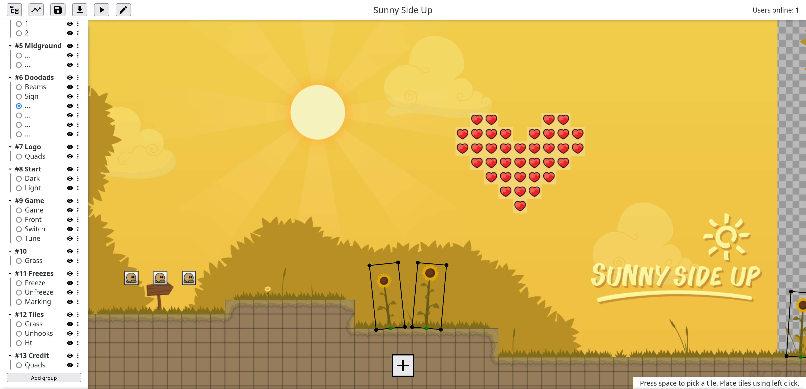

# Teeworlds Web Editor (TWWE)

Teeworlds / DDraceNetwork map editor. Online and collaborative, just like the game.

A demo server is hosted at [tw.thissma.fr](https://tw.thissma.fr).

## Status

The editor is now close to feature parity with the regular ddnet map editor. It is focused on the ddnet flavour of teeworlds. Support for 0.7 maps is mostly untested for now.

Completed:
 * create, delete, upload, download maps
 * tiles layers, game layer and ddnet physics layers (tele, tune, speedup, switch, front)
 * quads
 * images (upload png files, select layer images)
 * envelopes (color and position envelopes, play animations)
 * map info (author, credits, … and server settings)
 
Still missing:
 * sound layers & sound envelopes
 * Auto mappers
 * Select and edit multiple layers at a time
 * Proof and grid lines?
 * Some tools: import / merge maps, auto place game tiles, show tile info, …
 
Missing features specific to the online editor:
 * ddnet server running with the edited maps and with reload-on-save (#21)
 * Accounts?, manage permissions
 * Undo / Redo history (#31)
 * Chat?
 
Bugs are expected. It is advised to save regularly and if a bug happens, log out and back in to roll back to the previous save.
Maps corruptions are unlikely to happen though thanks to @patiga's [twmap library](https://gitlab.com/Patiga/twmap)

## Usage

Select the active layer by clicking one of the radio buttons on the left bar. Explore the ui, it resembles the ddnet editor for the most part.

Key/Mouse bindings:
 * Zoom in/out -> mouse wheel
 * Pan around -> `ctrl+left_click+drag` or `wheel_button+drag`
 * Place tiles -> `left_click+drag`
 * select a range of tiles -> `shift+left_click+drag`
 * Open tile picker -> hold `space_bar` and `left_click+drag` to select tiles
 * Flip brush horizontally / vertically -> `h` / `v`
 * Rotate brush clockwise / counterclockwise -> `r` / `shift+r`
 * Toggle layers view / envelope view -> `tab`
 * Save map -> `ctrl+s`
 * `right_click` opens context-menus on quad points, envelope points and envelope lines.

The Save button saves the map on the disk on the server side. If a teeworlds server using this map is running, enter `reload` in the server console to update it.

## Building and Running

The code is split into a client and a server part. The client generates a static site (html, js, …) that you can host wherever you want or even run locally. The server is a WebSocket server that the client connects to. The maps are stored on the server machine.

### Server

Have [rust](https://www.rust-lang.org/) and cargo installed. And create a server/maps/ directory with your .map files in it.

Run the server with `RUST_LOG=debug cargo run --release` to run in release mode with debugging info printed to stdout.

Use the first command-line argument to change address and port e.g. `cargo run localhost:3333` to run locally on port 3333.

Use the `--cert` and `--key` flags to enable TLS support for websocket. They must point to your PEM certificate and private key.

### Client

Copy the `env.example` file to `.env.production` and configure the websocket server url. For a TLS-encrypted websocket, the url scheme is `wss://`. Otherwise, use `ws://`.

Have [npm](https://www.npmjs.com/) installed and run `npm install` in the client directory to install dependencies, `npm run dev` to run a dev server and `npm run build` to produce a release in the `dist` directory.

Note: the client is written in non-strict Typescript. Typescript is only used for IDE hints and documentation, but ignored by the [Vite](https://vitejs.dev/guide/features.html#typescript) bundler.
Use `npm run check` to run Typescript checks on the project.

## Roadmap

Future short-term goals are as follows:

 - [x] Improve **concurrency** on the server. ~Currently, the whole server state is protected by a single mutex which means there cannot be any simultaneous requests.~
 - [x] Allow editing multiple maps on a single server. The server will advertise which maps are available.
 - [x] Allow users to create, upload and download maps
 - [ ] Setup access permissions.
 - [x] Plugin to update a real Teeworlds or DDNet server (#21)
 - [ ] Stabilise and secure the server for a production(-ish) use.
 - [x] Add more editor tools for quads, envelopes, sounds etc.
